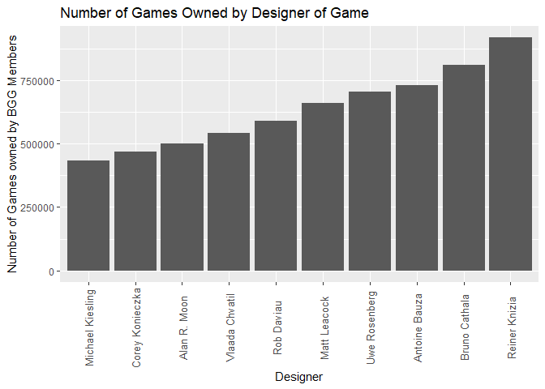
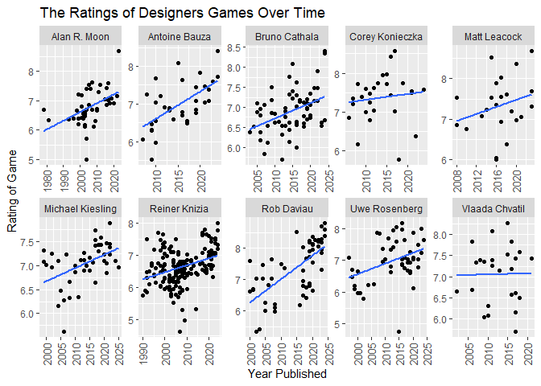
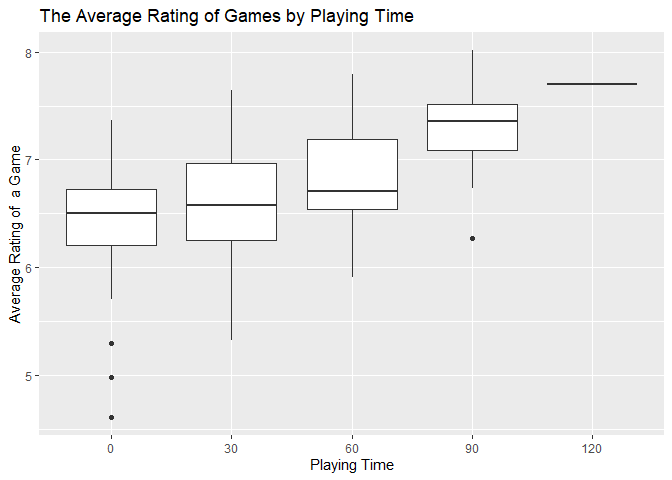
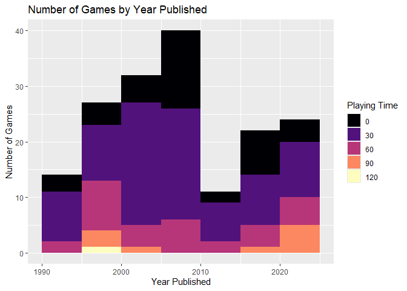
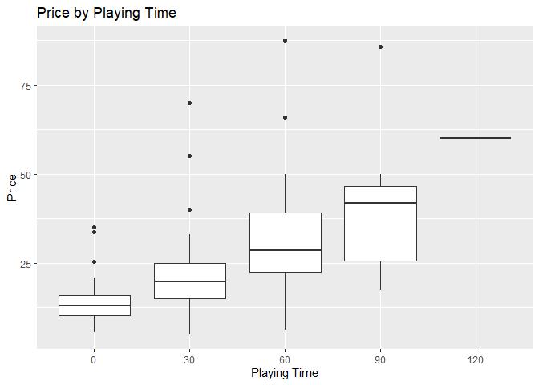
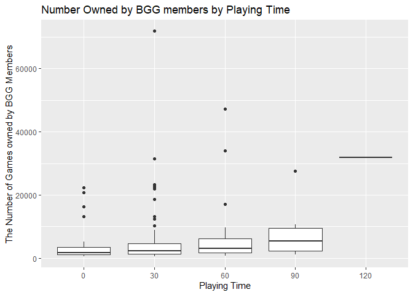
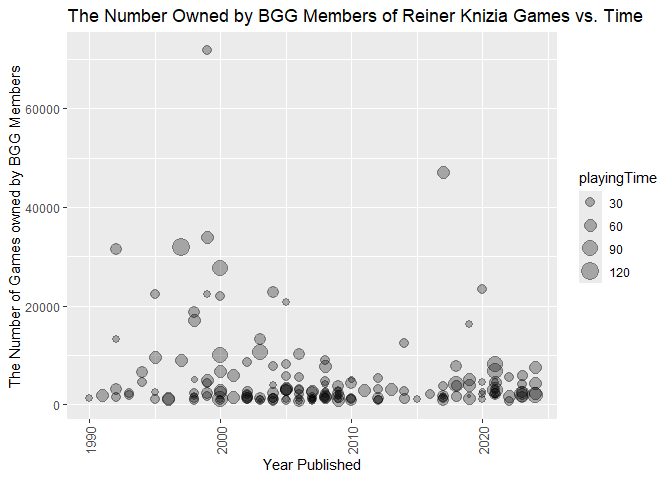
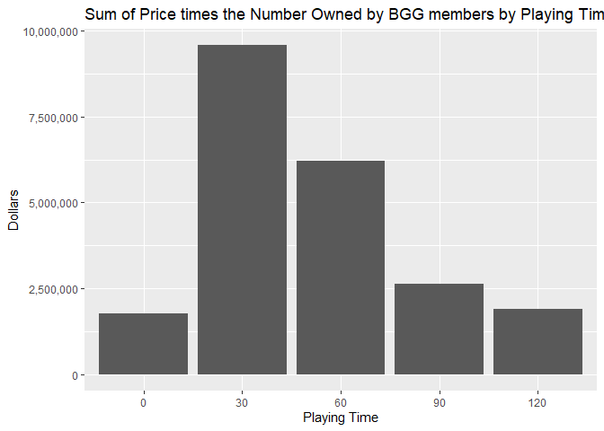

Final Project DS 2020
================
Zachary Malo
2025-05-14

## Introduction

The goals of this project ended up being to build a diverse data set
which many interesting analyses can be built from.I had recently got
into board games and had stumbled onto boardgamegeek which has so much
data on a ton of different board games. I wanted to create something
that would allow you to dig deeper into interesting elements of board
games from many different angles.

## Data Collection

I wanted to create a Dataset that could be used for many different types
of Analysis not just the ones used in the project, so there is alot of
data that ended up going unused during this project that I wanted to
include in this Repo. The data we used in the analysis was the designer
from BGGDesignerData, price, average(the average rating of a game),
owned (the number of people who own a game), and playingTime

### Pulling Initial Data

I started by obtaining the board game rankings dump csv from
boardgamegeek.com this contains all of their rankings and ratings
information as well as whether or not a game is an expansion. This csv
contains information on over 160,000 board games. I included a copy of
this table in this repo.

### Initial Cleaning

160,000 entries was too many I wanted to focus on games that were not
expansions, had over 500 user ratings and were ranked in their system.
This resulted in a data set of 6210 Games which felt much more
manageable.

``` r
game<-read.csv("boardgames_ranks.csv")
game <- game%>%dplyr::filter(game$is_expansion =='0')
game <- game%>%dplyr::filter(game$usersrated>=500)
game <- game%>%dplyr::filter(game$rank!=0)
game<-subset(game,select=-c(is_expansion))
```

### Obtaining Additional XML documents from boardgamegeek.com using their

XMLAPI2 The maximum number of game ids you can query is 20 and they want
you to wait at least 5 seconds between queries so this part takes a
while 311 \* 5seconds = around 26 minutes. The results of this are not
included because they are quite large because it ends up totaling about
90 MB.

``` r
library(xml2)
chunk_size <- 20
my_list <- split(game$id, ceiling(seq_along(game$id)/chunk_size))

n<-1
for (element in my_list) {
  ids<-paste(element,sep=" ",collapse = ",")
  url<-paste0("https://boardgamegeek.com/xmlapi2/thing?id=",ids,"&videos=1&stats=1",collapse="")
  print(url)
  xml<-read_xml(url)
  path<-paste0(getwd(),"/XML_files/",n,".xml",collapse = "")
  write_xml(xml,path)
  Sys.sleep(5)
}
```

### Parsing XML Documents with xml2 Library and XPATH Queries

Parsing thedata into different dataframes, 1 primarily
numeric(BGGCombinedData) and 6
categorical(BGGArtistData,BGGCategoricalData,BGGDesignerData,BGGFamilyData,
BGGMechanicData, BGGPublisherData) all included in the repo. XPATH is a
language designed get information from XML files, it was suprisingly
nice to use.

<details>
<summary>
Long Code Chunk Toggle
</summary>

``` r
library(xml2)
wideData<-data.frame(matrix(nrow = 0, ncol = 16))
colnames(wideData)<-c("id","numNames","minPlayers","maxPlayers","bestWith","recommendedWith","minAge","playingTime","minPlayTime","maxPlayTime","numVideos","owned","trading","wanting","wishing","numcomments")
#long data 
mechanicsData<-data.frame(matrix(nrow = 0, ncol = 2))
colnames(mechanicsData)<-c("id","mechanic")

categoricalData<-data.frame(matrix(nrow = 0, ncol = 2))
colnames(categoricalData)<-c("id","category")

familyData<-data.frame(matrix(nrow = 0, ncol = 2))
colnames(familyData)<-c("id","family")

designerData<-data.frame(matrix(nrow = 0, ncol = 2))
colnames(designerData)<-c("id","designer")

artistData<-data.frame(matrix(nrow = 0, ncol = 2))
colnames(artistData)<-c("id","artist")

publisherData<-data.frame(matrix(nrow = 0, ncol = 2))
colnames(publisherData)<-c("id","publisher")

for(i in 1:311){
 path<- paste0(getwd(),"/XML_files/xml",i,".xml",collapse = "")
 xml<-read_xml(path)
 node<-xml_find_all(xml,"/items/item")
  for(x in 1:length(node)){
    #wideData will be joined with Game
    query = paste0("/items/item[",x,"]/@id")
    id<-xml_text(xml_find_all(xml,query))
    
    query = paste0("/items/item[",x,"]/name")
    numNames<-length(xml_text(xml_find_all(xml,query)))
    
    query = paste0("/items/item[",x,"]/minplayers/@value")
    minPlayers<-xml_text(xml_find_all(xml,query))
    
    query = paste0("/items/item[",x,"]/maxplayers/@value")
    maxPlayers<-xml_text(xml_find_all(xml,query))
    
    query = paste0("/items/item[",x,"]/poll-summary/result[1]/@value")
    bestwith<-xml_text(xml_find_all(xml,query))
    
    query = paste0("/items/item[",x,"]/poll-summary/result[2]/@value")
    recWith<-xml_text(xml_find_all(xml,query))
    
    query = paste0("/items/item[",x,"]/minage/@value")
    minAge<-xml_text(xml_find_all(xml,query))
    
    query = paste0("/items/item[",x,"]/videos/@total")
    numVideos<-xml_text(xml_find_all(xml,query))
    
    query = paste0("/items/item[",x,"]/playingtime/@value")
    playingtime<-xml_text(xml_find_all(xml,query))
    
    query = paste0("/items/item[",x,"]/minplaytime/@value")
    minplaytime<-xml_text(xml_find_all(xml,query))
    
    query = paste0("/items/item[",x,"]/maxplaytime/@value")
    maxplaytime<-xml_text(xml_find_all(xml,query))
    
    query = paste0("/items/item[",x,"]/statistics/ratings/owned/@value")
    owned<-xml_text(xml_find_all(xml,query))
    
    query = paste0("/items/item[",x,"]/statistics/ratings/trading/@value")
    trading<-xml_text(xml_find_all(xml,query))
    
    query = paste0("/items/item[",x,"]/statistics/ratings/wanting/@value")
    wanting<-xml_text(xml_find_all(xml,query))
    
    query = paste0("/items/item[",x,"]/statistics/ratings/wishing/@value")
    wishing<-xml_text(xml_find_all(xml,query))
    
    query = paste0("/items/item[",x,"]/statistics/ratings/numcomments/@value")
    numcomments<-xml_text(xml_find_all(xml,query))
    
    wideData[nrow(wideData)+1,]<-list(id,numNames,minPlayers,maxPlayers,bestwith,recWith,minAge,playingtime,minplaytime,maxplaytime,numVideos,owned,trading,wanting,wishing,numcomments)
    
    #long Data for loops
    query = paste0("/items/item[",x,"]/link[@type='boardgamemechanic']/@value")
    mechanics<-xml_text(xml_find_all(xml,query))
    if(!identical(mechanics,character(0))){
      for(j in 1:length(mechanics)){
        mechanicsData[nrow(mechanicsData)+1,]<-list(id,mechanics[j])
      }
    }
    
    query = paste0("/items/item[",x,"]/link[@type='boardgamecategory']/@value")
    category<-xml_text(xml_find_all(xml,query))
    if(!identical(category,character(0))){
      for(j in 1:length(category)){
        categoricalData[nrow(categoricalData)+1,]<-list(id,category[j])
      }
    }
    
    query = paste0("/items/item[",x,"]/link[@type='boardgamefamily']/@value")
    family<-xml_text(xml_find_all(xml,query))
    if(!identical(family,character(0))){
      for(j in 1:length(family)){
        familyData[nrow(familyData)+1,]<-list(id,family[j])
      }
    }
    
    query = paste0("/items/item[",x,"]/link[@type='boardgamedesigner']/@value")
    designer<-xml_text(xml_find_all(xml,query))
    if(!identical(designer,character(0))){
      for(j in 1:length(designer)){
        designerData[nrow(designerData)+1,]<-list(id,designer[j])
      }
    }
    
    query = paste0("/items/item[",x,"]/link[@type='boardgameartist']/@value")
    artist<-xml_text(xml_find_all(xml,query))
    if(!identical(artist,character(0))){
      for(j in 1:length(artist)){
        artistData[nrow(artistData)+1,]<-list(id,artist[j])
      }
    }
    query = paste0("/items/item[",x,"]/link[@type='boardgamepublisher']/@value")
    publisher<-xml_text(xml_find_all(xml,query))
    if(!identical(publisher,character(0))){
      for(j in 1:length(publisher)){
        publisherData[nrow(publisherData)+1,]<-list(id,publisher[j])
      }
    }
    
  }
}
```

</details>

### Adding Price Data From boardgameprice.com using their api

This also took a very long time to query from them, and isn’t very
robust, I had a problem where I would run into an error half way through
after waiting 15 minutes, then fix if they return a null value
somewhere. It was very hard to trouble shoot because the information I
wanted was in a list within a list within a list within a list within a
list, which is a pain to conceptualize. Data is included in
BGGCombinedData in the repo.

``` r
library(jsonlite)
n<-1
for (element in 1:311) {
  e<-my_list[[element]]
  ids<-paste(e,sep=" ",collapse = ",")
  url<-paste0("https://boardgameprices.com/api/info?eid=",ids,"&currency=USD&sort=SMART&sitename=boardgameprices.com",collapse="")
  data<-fromJSON(url)
  for(thing in e){
     index<-match(thing,data[[5]][[7]])
     if(is.null(data[[5]][[8]][[index]])){
       BGGCombinedData$Price[n]<-NA 
       n<-n+1
       next
     }
     if(!identical(data[[5]][[8]][[index]],data.frame())){
      BGGCombinedData$Price[n]<-data[[5]][[8]][[index]][[3]][[1]]
      n<-n+1
      next
     }
     BGGCombinedData$Price[n]<-NA 
     n<-n+1
  }
  Sys.sleep(2)
}
```

## Initial Question Who has sold the most games in this dataset?

``` r
data<-read.csv("C:/Users/zachi/OneDrive/Desktop/final project/data/BGGCombinedData.csv")
data=select(data,-c("X"))
designerData<-read.csv("C:/Users/zachi/OneDrive/Desktop/final project/data/BGGDesignerData.csv")
designerData=select(designerData,-c("X"))
```

    ## Joining with `by = join_by(id)`

    ## # A tibble: 10 × 4
    ##    designer         count mean_value numowned
    ##    <chr>            <int>      <dbl>    <int>
    ##  1 Reiner Knizia      170       6.64   918353
    ##  2 Bruno Cathala       66       6.90   809720
    ##  3 Antoine Bauza       33       6.98   732495
    ##  4 Uwe Rosenberg       50       6.99   705165
    ##  5 Matt Leacock        23       7.33   662230
    ##  6 Rob Daviau          56       7.38   589825
    ##  7 Vlaada Chvatil      25       7.05   542899
    ##  8 Alan R. Moon        45       6.78   501910
    ##  9 Corey Konieczka     27       7.37   469966
    ## 10 Michael Kiesling    44       7.03   432739

<!-- -->

I started by reading in The BGGCombinedData.csv and the
BGGDesignerData.csv into two data frames. I performed a left join on the
id column with the BGGCombinedData on the left. I then used Summarise to
to sum All of the owned games for each designer. Then I removed the
games with uncredited designers. Arranged the resulting table in
descending order and took the top 10 results. I then made a column chart
arranged in acsending order. The result we find that Reiner Knizia has
sold the most games of games designers included in the dataset. This is
not the same thing as number of games sold overall, but the number which
is reported by users of BGG as them owning it.

### Do BoardGame DesignersImprove over Time?

    ## `geom_smooth()` using formula = 'y ~ x'

<!-- -->

I found that the top selling game designers in general tend to make
games that receive higher ratings as there careers progress.

### What’s Going on With Reiner Knizia?

<!-- -->

I noticed a defined dip in Reiner Knizia’s plot that wasn’t present in
the plots of other top selling game designers. What could have caused
this dip?

### Does Playing Time Have something to do with it?

<!-- -->

I noticed that the ratings of his games had tended to increase as the
amount of playing time increased so I wondered if this had some thing to
do with this.

    ## Warning: package 'viridis' was built under R version 4.4.3

    ## Loading required package: viridisLite

<!-- -->

I made a histogram which shows how many games he made in a 5 year period
and how many of those games were a certain playing time category. I
found that during the period of this negative trend in average game
rating per year, he was producing a higher proportion of games that were
shorter in length. Since his games that were shorter in length tended to
be lower rated on BGG on average I thought that this was a potential
explanation for the dip in average game rating per year.

### Why doesn’t He just Make longer Games?

<!-- -->

I had noticed that his games that were longer also sold for more money,
so, wouldn’t this be an incentive to make longer games.I think Something
else had to be going on.

<!-- -->

I decided to look at the distribution of how many copies were owned by
playing time category. This showed me there wasn’t a significant
difference in the median amount of owned games by playing time.

<!-- -->

I found that his longer games did not tend to be owned significantly
more copies as his shorter length games. And that his most owned game is
in one of the shorter time categories

### Money,Money,Money

<!-- -->

I decided to try and estimate which time category of game made Reiner
Knizia the most money through his career by multiplying the price of a
game by the number of copies owned. This is imperfect because I don’t
have price data for some games. but looking at the games with missing
price data they are mostly in the 0-60 minute range. We can see that the
category of games that took 30-59 minutes to play ended up being the
category which made Reiner Knizia the most money, even though price
tended to increase as playing time did. This shows that just because a
category of game is higher rated and more expensive does not necessarily
translate to earning someone more money for reasons such as the
potential output of games being higher if you make smaller games.

## Conclusion

I think this analysis shows how this data set can be used to drill down
into your questions. We started with Who sold the most games, and ended
trying to figure out why there was a period where in Reiner Knizia’s
career where there was a negative trend in the ratings of games that he
designed. The most interesting parts of this analysis to me were that
even though a game could be more highly rated that doesn’t indicate that
is more worthwhile to make more games like that. Also This indicates
that a more profit driven approach can lead to negative trends in the
overall ratings of games.

## Next Steps

If I wanted to dig deeper into the question I left off with I would look
at some of the categorical data. Like if the categories of his biggest
hit influenced the types of games he made after. I would also like to
know if similar trends can be found in the works of other game
designers. Also exploring other trends like are more recently made games
better than older games? How have the most popular game mechanics
changed over the years? Would a dataset which includes more games
provide better insights?
